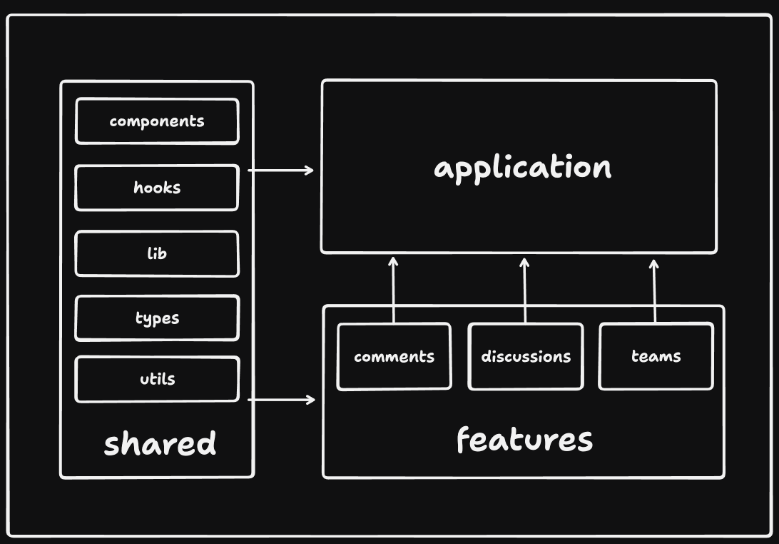

## ライブラリ

項目|ライブラリ|ライセンス|説明
--|--|--|--
UIライブラリ|[react](https://github.com/facebook/react)|MIT
UIライブラリ|[react-dom](https://github.com/facebook/react)|MIT
Webアプリフレームワーク|[Hono](https://github.com/honojs/hono)|MIT|速い, 軽い, Web標準.RPCのために導入
ビルドツール|[vite](https://github.com/vitejs/vite)|MIT
Refetch用プラグイン|[@vitejs/plugin-react-swc](https://github.com/vitejs/vite-plugin-react-swc)|MIT|uses [SWC](https://swc.rs/) for Fast Refresh
環境変数|[dotenv-cli](https://github.com/entropitor/dotenv-cli)|MIT|npm script内で環境変数を読み込むため
デプロイツール|[@azure/static-web-apps-cli](https://github.com/Azure/static-web-apps-cli)|MIT

## フロントエンドアーキテクチャ
Reactのベストプラクティスである[bulletproof-react](https://github.com/alan2207/bulletproof-react)をベースに開発する。

### 理念
銀の弾丸を目指すわけではない。

日本語|英語
--|--
はじめやすい|Easy to get started with|
理解しやすく、維持しやすい|Simple to understand and maintain
適したツールを使用|Uses the right tools for the job
境界が明確|Clean boundaries between different parts of the application
チーム全員が同じ考えで進められる|Everyone on the team is on the same page when it comes to how things are done
安全|Security
パフォーマンス|Performance
コードベースとチーム規模の面でのスケーラビリティ|Scalability in terms of codebase and team size
問題をできるだけ早く検出|Issues detectable as early as possible


### Project Structure
機能関連のコードと共有コンポーネントが混在しない作りとする。
一方向のコードベース アーキテクチャを強制することでコードベースを予測可能とする。



```
src
|
+-- app               # application layer containing:
|   |
|   +-- routes        # application routes / can also be called pages
    +-- app.tsx       # main application component
    +-- app-provider  # application provider that wraps the entire application with global providers
+-- assets            # assets folder can contain all the static files such as images, fonts, etc.
|
+-- components        # shared components used across the entire application
|
+-- config            # global configurations, exported env variables etc.
|
+-- features          # feature based modules
|
+-- hooks             # shared hooks used across the entire application
|
+-- lib               # reusable libraries preconfigured for the application
|
+-- stores            # global state stores
|
+-- test              # test utilities and mocks
|
+-- types             # shared types used across the application
|
+-- utils             # shared utility functions
```


